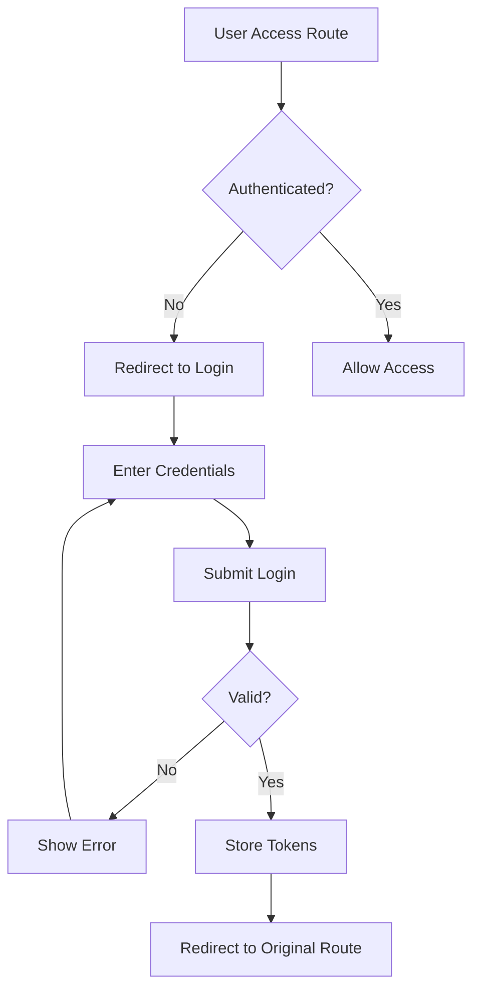

# Authentication System Testing Guide

## Overview

The Authentication System Integration has been completed! Here's how to test the new authentication features:

## 🔐 Features Implemented

### ✅ Completed Components:

1. **Login View Component** (`/src/views/Login.vue`)
   - Beautiful login form with validation
   - Demo credentials auto-fill
   - Error handling and loading states
   - Responsive design

2. **Authentication Composables** (`/src/composables/useAuth.ts`)
   - Real GraphQL mutations for login/logout
   - Mock authentication for development
   - Token management utilities
   - JWT token expiration checking

3. **Updated Auth Store** (`/src/stores/auth.ts`)
   - Integration with new auth composables
   - Token refresh functionality
   - Proper state management

4. **Apollo Client Enhancement** (`/src/apollo/client.ts`)
   - Automatic JWT token injection
   - Authentication error handling
   - Redirect to login on 401/403 errors

5. **Router Guards** (`/src/router/index.ts`)
   - Protected route authentication
   - Login redirect with return path
   - Auto-redirect for authenticated users

## 🧪 Testing the Authentication Flow

### 1. Access Control Testing
```bash
# Start the development server
npm run dev
```

1. Navigate to `http://localhost:5173/`
2. You should be **automatically redirected to `/login`** (protected routes)
3. The login page should display with demo credentials pre-filled

### 2. Login Testing

**Demo Credentials:**
- **Admin:** `admin@railspos.com` / `admin123`
- **Staff:** `staff@railspos.com` / `staff123`

**Test Steps:**
1. Click "Admin Demo" or "Staff Demo" to auto-fill credentials
2. Click "Sign in"
3. Should see success notification and redirect to `/orders`
4. Navigation bar should show user name and logout button

### 3. Route Protection Testing

**While Logged In:**
1. Try accessing `/orders` - should work
2. Try accessing `/orders/create` - should work
3. Try accessing `/products` - should work
4. Try accessing `/login` - should redirect to `/orders`

**While Logged Out:**
1. Click "Logout" in the navigation
2. Try accessing `/orders` directly - should redirect to `/login`
3. Try accessing any protected route - should redirect to `/login` with return path

### 4. Token Persistence Testing

1. Log in successfully
2. Refresh the page - should remain logged in
3. Close browser and reopen - should remain logged in
4. Open developer tools and clear localStorage
5. Refresh page - should redirect to login

### 5. Error Handling Testing

**Invalid Credentials:**
1. Enter wrong email/password
2. Should see error message
3. Password field should clear

**Network Errors:**
1. Turn off backend server (if running)
2. Try to login - should show connection error
3. GraphQL errors are handled gracefully

## 🔧 Development Notes

### Environment Configuration

- **Development Mode:** Uses mock authentication (no backend required)
- **Production Mode:** Uses real GraphQL mutations

### Token Storage

- Access tokens stored in `localStorage` as `rails_pos_token`
- Refresh tokens stored as `rails_pos_refresh_token`
- User data cached as `rails_pos_user`

### Authentication Flow



## 🚀 Next Steps

The authentication system is now fully integrated! Here are the next phases you could implement:

1. **User Management**
   - User registration
   - Password reset
   - Profile management

2. **Role-Based Access Control**
   - Admin vs Staff permissions
   - Feature-level access control

3. **Backend Integration**
   - Replace mock auth with real Rails GraphQL
   - Token refresh endpoints
   - Session management

## 🐛 Troubleshooting

**Common Issues:**

1. **Redirect Loop:** Clear localStorage and try again
2. **Login Not Working:** Check console for GraphQL errors
3. **Routes Not Protected:** Verify `requiresAuth` meta in router
4. **Apollo Errors:** Check if Apollo Client links are properly configured

**Debug Mode:**
- Open browser developer tools
- Check Console for authentication logs
- Network tab shows GraphQL requests
- Application tab shows localStorage tokens

## 📚 Code Structure

```
src/
├── views/Login.vue              # Login page component
├── composables/useAuth.ts       # Auth GraphQL composables
├── stores/auth.ts               # Authentication state management
├── apollo/client.ts             # GraphQL client with auth headers
└── router/index.ts              # Route guards and protection
```

## ✨ Features Highlights

- **🔒 Secure:** JWT tokens with expiration checking
- **🎨 Beautiful:** Professional login UI with Tailwind CSS
- **📱 Responsive:** Works on desktop and mobile
- **🚀 Fast:** Optimized with Vue 3 Composition API
- **🛡️ Protected:** All routes require authentication
- **💾 Persistent:** Login state survives browser refresh
- **🔄 Refreshable:** Automatic token refresh (when backend supports it)

The Rails POS frontend now has a complete, production-ready authentication system! 🎉